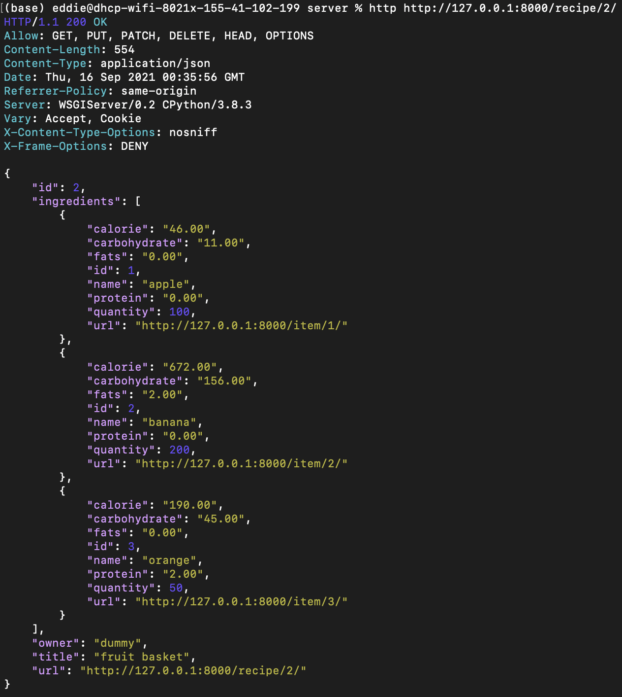

# sw-mini
Senior Mini Project
A barcode scanning application with nutritional info from FDA API.

# File Names
* env: virtual environment folder, keep in same directory as top folder for *server*
* server: contains most of the Django code

# Design Choices

## Backend
### Main Goals
1. **User creates a recipe or log**: Sends HttpResponse to Backend with JSON in body, then invokes function through url call. JSON contains information on who made the instance and what ingredients are involved
2. **User queries for their recipe or log**: Frontend would curl into a url linked to the user's username to retrieve the desired information
3. **Frontend requests nutritional data for recipe or log**: Frontend curls to the url for the specific recipe/log, followed by a function name to get a JSONResponse
4. **Authenticated data retrieval**: Only provide data to logged in users


The intial intent was to have a Django framework serving as a backend service for the ReactJS frontend to interact. The interaction would be mostly through HttpResponse and Url queries. At its current state, all interactions between the frontend and backend would operate as listed in the following:

## Frontend

# Development
## Backend (Edward Hong)
### Django Framework
The backend started from Mozilla's article on making web frameworks, I chose [Django Framework](https://developer.mozilla.org/en-US/docs/Learn/Server-side/First_steps/Web_frameworks) since I had some experience dealing with it. I started implementing the models and views I planned in the Design image shown above and was successful in interacting with it through shell commands.
Most of my time went into research on binding url patterns to the Django Views I designed. At its current state, I can navigate the framework with curl from shell and retrieve information with the appropriate commands.

#### Demonstration
1. Create Recipe: functionable only through shell, could not bind view to URL endpoint
```
from barcodes.models import *
from barcodes.views import *
from barcodes.api import *

user = User.objects.all().filter(username='dummy')[0] # index queryset
recipe1 = Recipe(title='fruit basket', owner=user)
recipe1.save()
item1 = Item(**getJSON('apple',100)
item1.save()
item2 = Item(**getJSON('banana',200)
item2.save()
item3 = Item(**getJSON('orange',50)
item3.save()
recipe1.ingredients.add(item1,item2,item3)
recipe.save()
```
Through shell commands, I save a recipe (with no ingredients) to initialize a referrable id. Then save the individual items (and save to assign id) and then populate the ingredient parameter. The **itemname** can be replaced with a 12-digit barcode and still work.


Getting recipe results through http.
```
log1 = Log(owner=user)
log1.save()
log1.data.add(item1,item3)
log1.save()
```
I can similarily do the same for logs, where I populate the data field after saving to assign an id


Getting log results through http.

##### Findings
In the process of implementing the function, I had not considered how I should structure my URL heiarchy. Ideally to retrieve a recipe, I should do the following:
```
http (website)/(username)/(recipe)/(recipe_id)/
```
However, at its current state, the recipes are routed to another page, and retrieving it would require the following:
```
http (website)/(recipe)/(recipe_id)/
```
In hindsight, the current URL endpoints were not well established. Not being able to associate the recipe owner to the user through the URL made the API unintuitive and unflexible to further development. Trying to associate them now would mean rewriting barcodes/views.py since the Views were inherited from template Viewsets given by the framework. I'm assuming a method to fix this is to inherit a simpler Viewset and customize its functions (i.e., list, create, retrieve, update, destroy). Given the remaining time and conflicts with deploying on Firebase, I don't think it is feasible to implement the rest of this functionality. I much rather get the project to a functional state.


2. 


Once its completed to an operational state, I tried to deploy the project on Firebase. However, I found out that the framework I was developing was not suitable to deploy on Firebase, the host that we were trying to use. Firebase is more suitable for static content but the Django framework is designed to be dynamic.

### Deploying Django framework on Firebase
The Firebase documentation provides a method to deploy a Django project on their website, and the process goes as follows. I would pair Google Cloud Run with Firebase to build the REST APIs as microservices. That is done by deploying the framework as an application packaged in a container image. Then, Firebase can direct HTTPS requests to the containerized app. ([Link](https://firebase.google.com/docs/hosting/cloud-run))
(Post images of containerizing app)

## Frontend (Eva Zhou)


# Findings


# Credits
**Front End Designer**: Eva Zhou
**Back End Designer**: Edward Hong
