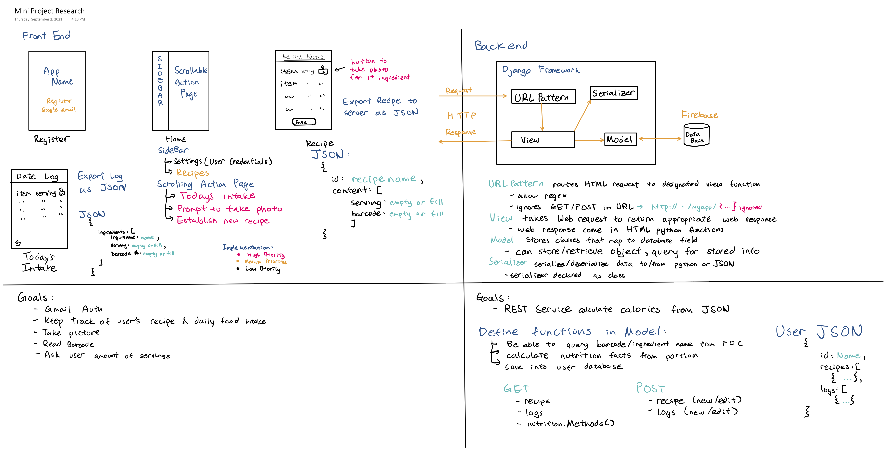
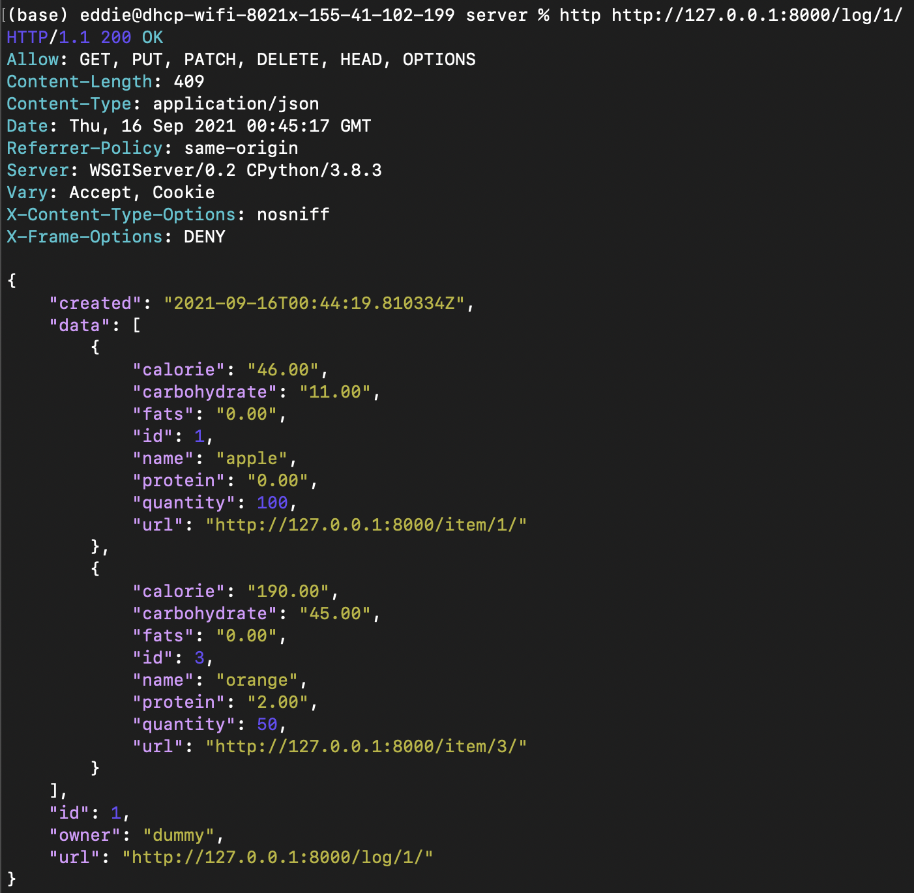
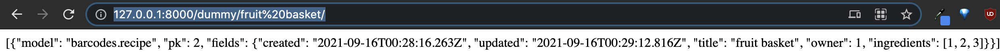
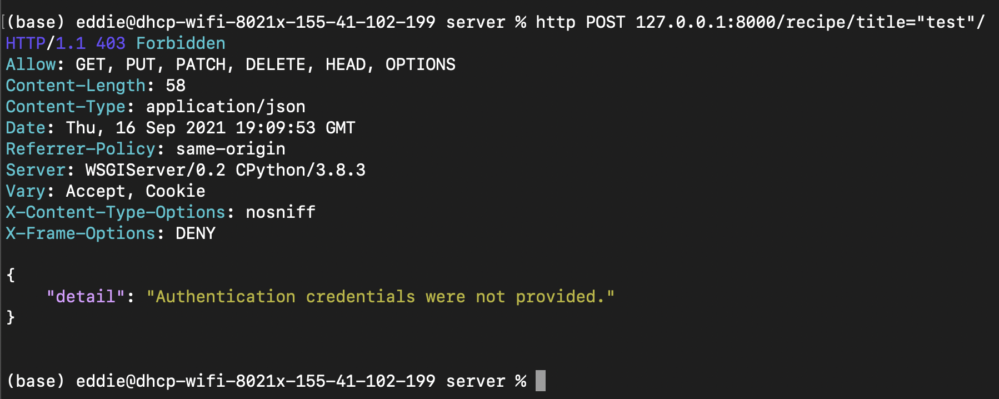
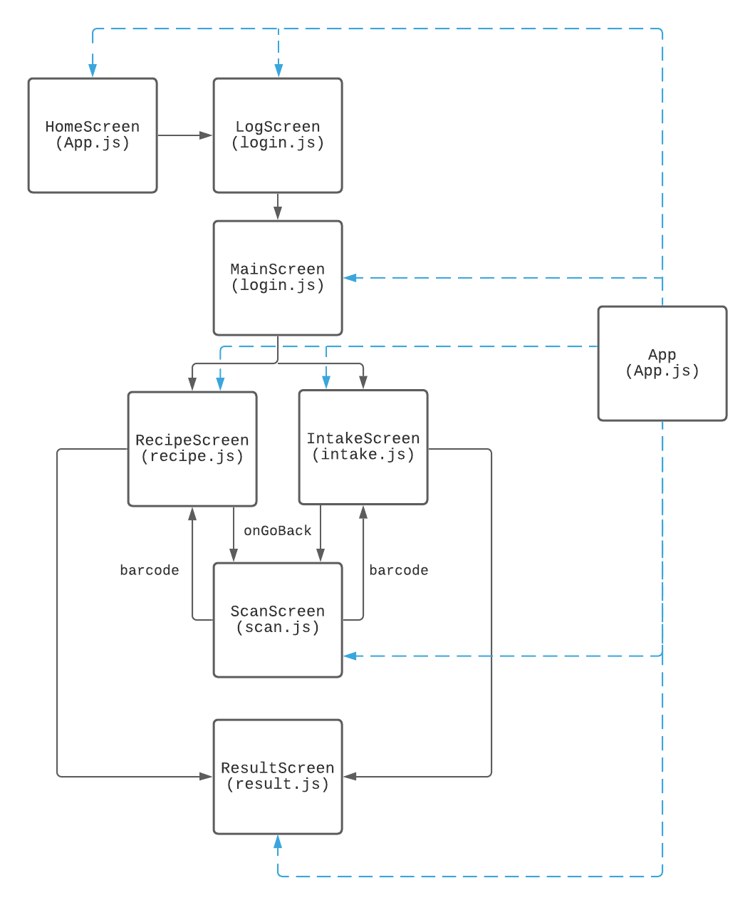
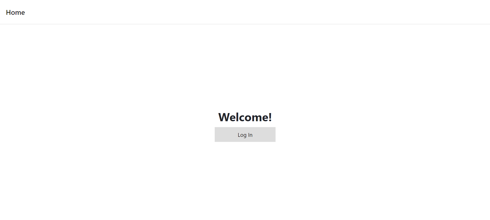
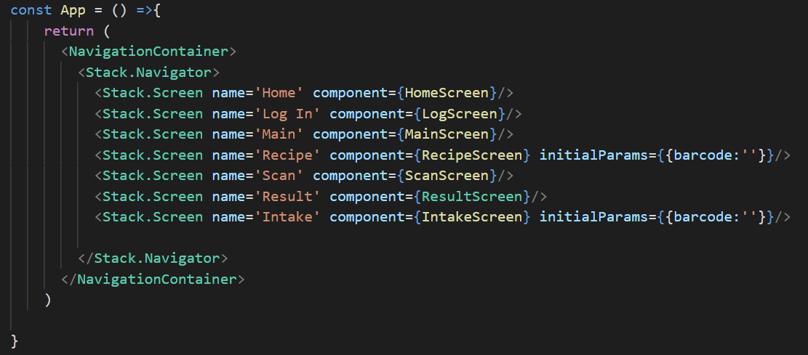
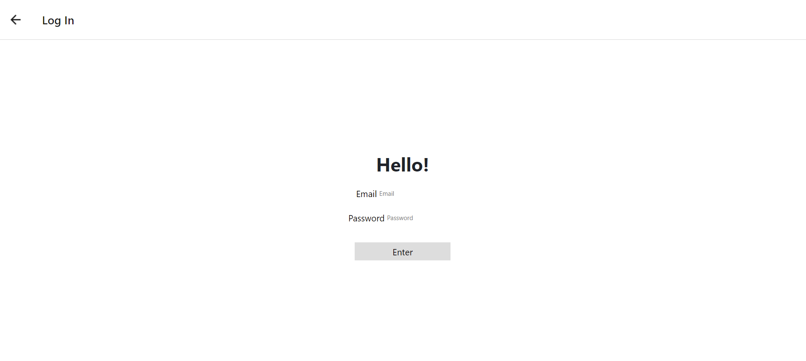
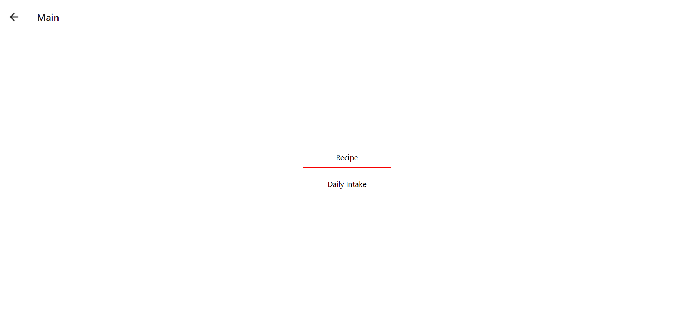
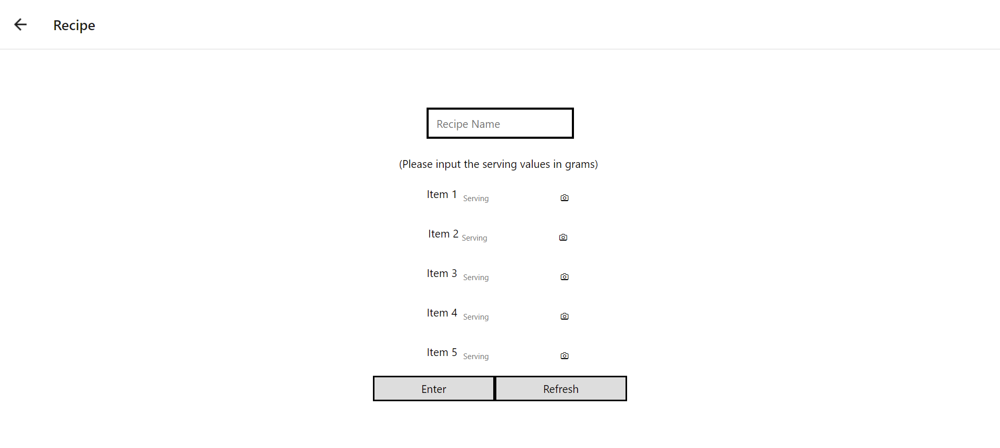

# Table of Contents
- [sw-mini Summary](#sw-mini-summary)
- [File Names](#file-names)
- [Design Choices](#design-choices)
    - [Backend](#backend)
    - [Frontend](#frontend) 
- [Backend Development](#backend-development) 
    - [Demonstration](#demonstration)
- [Reflection](#Reflection)
- [Credits](#credits)


# sw-mini Summary
Senior Mini Project
A barcode scanning application with nutritional info from FDA API. The project is not deployable onto Firebase given the remaining amount of time, **details will be listed below**. ([Click to see what works and what doesn't](#demonstration))


# File Names
* env: virtual environment folder, keep in same directory as top folder for *server*
* server: contains Django server backend
* public: directory with files to deploy Django onto Google Cloud Run
* frontend: contains React Native framework 


# Design Choices


The design is implemented with ReactJS front end that communicates with a Django backend server. The frontend would have 4 main interfaces: Login, Homepage, Recipe, Intake. Login would provide authentication of the user in session, Homepage would direct users to establish a log or recipe, Recipe stores recipe and display established recipe, Intake would be the same as Recipe. 

Backend would be a Django server that communicates with the frontend through HttpResponse/Response/JsonResponse requests. Through the Requests, the frontend could tailor the requests to only query for the information it needs. Similarily, through Requests, the frontend could POST information into the database on the server.


## Backend
### Main Goals

1. **User creates a recipe or log**: Sends HttpResponse to Backend with JSON in body, then invokes function through url call. JSON contains information on who made the instance and what ingredients are involved
2. **Frontend requests nutritional data for recipe or log**: Frontend curls to the url for the specific recipe/log, followed by a function name to get a JSONResponse/HttpResponse
3. **Authenticated data retrieval**: Only provide data to logged in users
4. **Deploying server onto Firebase**: Upload Django server to Firebase for ReactJS to interact with

The intial intent was to have a Django framework serving as a backend service for the ReactJS frontend to interact. The interaction would be mostly through HttpResponse and Url queries. At its current state, all interactions between the frontend and backend would operate as listed in the following:


## Frontend
### Main Goals 

1. **Users log in with their google emails**: 

# Backend Development

The backend started from Mozilla's article on making web frameworks, I chose [Django Framework](https://developer.mozilla.org/en-US/docs/Learn/Server-side/First_steps/Web_frameworks) given my knowledge of the framework, there are plenty of libraries to implement authentication and url-based querying. Deciding to go with Django, I started implementing the models and views I planned in the Design image shown above and was successful in interacting with it through shell commands.
Most of my time went into research on binding url patterns to the Django Views I designed. At its current state, I can navigate the framework with curl from shell and retrieve information with the appropriate commands.

## Demonstration
**1. Create Recipe:** functionable only through shell, could not bind POST requests to views from URL endpoint

Through shell commands, I save a recipe (with no ingredients) to initialize a referrable id. Then save the individual items (and save to assign id) and then populate the ingredient parameter. The **itemname** can be replaced with a 12-digit barcode and still work.


```
from barcodes.models import *
from barcodes.views import *
from barcodes.api import *

user = User.objects.all().filter(username='dummy')[0] # index queryset
recipe1 = Recipe(title='fruit basket', owner=user)
recipe1.save()
item1 = Item(**getJSON('apple',100)
item1.save()
item2 = Item(**getJSON('banana',200)
item2.save()
item3 = Item(**getJSON('orange',50)
item3.save()
recipe1.ingredients.add(item1,item2,item3)
recipe.save()
```

The same shell calls can be applied to log files for users.

```
log1 = Log(owner=user)
log1.save()
log1.data.add(item1,item3)
log1.save()
```


 Image of Calling Recipe  | Image of Calling Log 
:-------------------------:|:-------------------------:
  |  
*Getting recipe results through http*| *Getting log results through http*

---
**Reflection on How Goals Were Met**

In the process of implementing the function, I had not considered how I should structure my URL heiarchy. Ideally to retrieve a recipe, I should do the following:
```
http (website)/(username)/(recipe)/(recipe_id)/
```
However, at its current state, the recipes are routed to another page, and retrieving it would require the following:
```
http (website)/(recipe)/(recipe_id)/
```
In hindsight, the current URL endpoints were not well established. Not being able to associate the recipe owner to the user through the URL made the API unintuitive and unflexible to further development. Trying to associate them now would mean rewriting barcodes/views.py since the Views were inherited from template Viewsets given by the framework. I'm assuming a method to fix this is to inherit a simpler Viewset and customize its functions (i.e., list, create, retrieve, update, destroy). Given the remaining time and conflicts with deploying on Firebase, I don't think it is feasible to implement the rest of this functionality. I much rather get the project to a functional state.

---


**2. User Queries For Their Recipe or Log**

As demonstrated in Goal 1, I could index into a specific recipe or log given the ID of the object. As of now, a user can find all the urls to their recipes and logs in the /user endpoint. Furthermore, a user can query for their recipe with **(website)/(username)/(title)**, which returns an ID for the user to find their recipe using **(website)/recipe/id**.


The logs have a **created** field, storing datetime information on when the logs are made, but the problem is Django querying does not work well with datetime datatypes. The current implementation is to query by username: **(website)/(username)/get/log**, which returns all id's to the user to find their logs with **(website)/log/id**. 


**3. Authenticated Data Retrieval:** Not Possible on Firebase

The Django server has authentication implemented in the framework, which only allows users with the right credientials to write or edit information they have created. If done anonymously, the attempt will be denied by the server.

| Image of Authenication Attempt | 
|:-------------------------:|
|  |
|*Http POST will not work if done anonymously*|


---
**Details on Why Authentication Doesn't Work**

Initially, I planned on packaging the authentification service solely on the Django framework, but upon testing in deployment, I found numerous problems with this idea. Firstly, I did not realize that Django comes with its own user interface, and its authentification services would authorize the current user in session through cookies. On further research, I found that this issue can be circumvented by providing the user a token which the user would include in the POST request to the server.

However, I deem this solution unreasonable as it poses a security threat. Since I've decided all communications between the frontend and backend to be solely HTTP Requests, any packet analyzers (netShark) could decode the url and get the token to an authenticated user. Whereas the provided authentication services of Firebase would have been much more secure for it [encrypts](https://firebaseopensource.com/projects/firebase/scrypt/) all its credentials.

---


4. Deploying Server Onto Firebase: Possible, but not enough time to troubleshoot

Once the project was completed to an operational state, I tried to deploy the project on Firebase. However, I found out that the framework I was developing was not suitable to deploy on Firebase, the host that we were trying to use. Firebase is more suitable for static content but the Django framework is designed to be dynamic.

The Firebase documentation provides a method to deploy a Django project on their website, and the process goes as follows. I would pair Google Cloud Run with Firebase to build the REST APIs as microservices. That is done by deploying the framework as an application packaged in a container image. Then, Firebase can direct HTTPS requests to the containerized app. 

I've made an attempt on containerizing the app, as shown from the ([tutorial](https://cloud.google.com/python/django/run)). I was able to authorize Cloud SQL onto my machine and establish a PostgresSQL dataset on Google Cloud server. I also made a Cloud Storage bucket to store the Django static assets and gave the Clould Buiild access to the SQL. However, I could not finish the rest of the steps, which required a .yaml file and Dockerfile to deploy Django on the Cloud server. Given enough time, maybe I could properly deploy the Django app onto the Cloud server.


## Frontend 

# Frontend Development 

For the frontend development, React Native is employed as the framework engine. Additionally, Expo is the main set of tools and services that are used in building the multi-platform application framework for this mini project. For implementing specific functions, the following stes of tools are installed: 

1. React Native Navigation: https://reactnavigation.org/docs/getting-started
2. Expo BarCodeScanner: https://docs.expo.dev/versions/latest/sdk/bar-code-scanner/
3. React Native Firebase: https://rnfirebase.io/ 

The development OS is Windows 10, and the application is run in web brouser during testing. 

# Frontend Hierarchy and Files 

**Hierarchy Diagram** 



**App.js** 

const HomeScreen: displays the design for the Home screen and navigates to the Login Screen when the user clicks on the button. 


const App: initiates the stack navigator, which manages the transitions between screens 



**login.js** 

const LogScreen: displays the design for the Login screen. When the user clicks on the "Enter" button, the "email" and "password" inputs are stored, and the user is navigated to the Main screen.


The first main goal **Users log in with their google emails** should be achieved here. However, since Expo GoogleSignIn doesn't support web platform and I fail to set up other platforms, this goal is not accomplished. 

**main.js** 

const MainScreen: displays the design for the Main screen, navigates to the Recipe screen when the user clicks on "Recipe", and navigates to Intake screen when the user clicks on "Daily Intake". 



**recipe.js** 

const RecipeScreen: displays the design for the Recipe screen, navigates to the Scan screen when the user clicks on the camera icon, stores the barcodes scanned and returned by the Scan screen, clear the recorded inputs up when the user clicks on the "Refresh" button, and stores all the input values (including the barcodes) and navigates to the Result screen when the user clicks on the "Enter" button.


---
**The Way I Implement the Back-and-Forth Transitions between Recipe Screen and Scan Screen** 
First, I import {useState} from 'react' package. 
---

# Reflection
**Edward Hong**
Given my lack of knowledge in app development, I should have asked for advice on how one should be structured. Advice would be crucial when it came to how the app should be developed, since I did not know there was a distinction between static and dynamic content that could be hosted onto Firebase. I think the [design](#design-choices) I came up with is not bad but its certainly unsuitable for the host we chose. In retrospect, I should have done more research on the feasibility of hosting a Django project on Firebase. 

# Credits
**Front End Designer**: Eva Zhou
**Back End Designer**: Edward Hong
